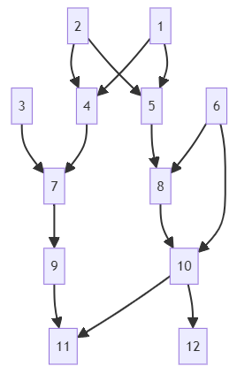

# FnR

<!-- badges: start -->

[](https://github.com/nilforooshan/FnR/actions/workflows/R-CMD-check.yaml)
[](https://cran.r-project.org/package=FnR)
[](https://cran.r-project.org/package=FnR)
[](https://github.com/nilforooshan/FnR)
[](https://github.com/nilforooshan/FnR/blob/master/LICENSE.md)
[](https://github.com/nilforooshan/FnR/graphs/contributors/)

<!-- badges: end -->

FnR ("F" stands for inbreeding coefficient and "R" stands for the numerator relationship coefficient) is an R package for the estimation of inbreeding coefficients of animals in the pedigree or their future progeny, and numerator relationship coefficients between pairs of individuals.

## Installation

You can install the development version of FnR like so:

```r
devtools::install_github('nilforooshan/FnR')
```

## Examples

Let's use the following example pedigree.



```r
(ped <- data.frame(
  ID = 1:12,
  SIRE = c(0, 0, 0, 2, 2, 0, 4, 6, 0, 6, 10, 10),
  DAM = c(0, 0, 0, 1, 1, 0, 3, 5, 7, 8, 9, 0)
))
```

```
   ID SIRE DAM
1   1    0   0
2   2    0   0
3   3    0   0
4   4    2   1
5   5    2   1
6   6    0   0
7   7    4   3
8   8    6   5
9   9    0   7
10 10    6   8
11 11   10   9
12 12   10   0
```

Let's assume that previously, 9 of 12 animals were in the pedigree, and inbreeding (`f`) and `d` coefficients (diagonal elements of the diagonal matrix **D** in $\mathbf A = \mathbf{TDT}'$) were calculated and saved.

```r
oldped <- ped[1:9, ]
(oldrun <- resume_inbreed(oldped, export_d = TRUE))
```

```
$f
[1] 0 0 0 0 0 0 0 0 0

$d
[1] 1.00 1.00 1.00 0.50 0.50 1.00 0.50 0.50 0.75
```

Calculating inbreeding coefficients as if `f` and `d` coefficients from the previous analysis are not available:

```r
resume_inbreed(ped)
```

```
[1] 0.000000 0.000000 0.000000 0.000000 0.000000 0.000000 0.000000 0.000000 0.000000 0.250000 0.015625 0.000000
```

Calculating inbreeding coefficients as if `f` coefficients from the previous analysis are available, but not `d` coefficients:

```r
resume_inbreed(ped, f = oldrun$f)
```

```
[1] 0.000000 0.000000 0.000000 0.000000 0.000000 0.000000 0.000000 0.000000 0.000000 0.250000 0.015625 0.000000
```

Calculating inbreeding coefficients as if `f` and `d` coefficients from the previous analysis are available:

```r
resume_inbreed(ped, f = oldrun$f, d = oldrun$d)
```

```
[1] 0.000000 0.000000 0.000000 0.000000 0.000000 0.000000 0.000000 0.000000 0.000000 0.250000 0.015625 0.000000
```

Let's calculate the numerator relationship coefficients between two groups of animals, one's members not among dams, and the members of the other not among sires.

```r
calcR(ped, set1 = c(12, 6), set2 = c(11, 8), type = "notdam-notsire")
```

```
Estimating inbreeding coefficients based on Meuwissen and Luo (1992)
Calculating numerator relationship coefficients based on Van Vleck (2007)
          11     8
12 0.3203125 0.375
6  0.3750000 0.500
```

What is the inbreeding coefficient of a future progeny of 11 and 12?
It is half of the relationship coefficient between the two individuals (0.320312/2).

Since `"notdam-notsire"` is the default type, `type = "notdam-notsire"` might be omitted.
Where relationship coefficients between dams and between sires are needed, `type = "dam-dam"` and `type = "sire-sire"` are used, respectively.

Let's calculate the numerator relationship coefficients between dam 7 and dams 8 and 9.

```r
calcR(ped, set1 = 7, set2 = 8:9, type = "dam-dam")
```

```
Estimating inbreeding coefficients based on Meuwissen and Luo (1992)
Calculating numerator relationship coefficients based on Van Vleck (2007)
      8   9
7 0.125 0.5
```

The relationship coefficients between sires 2 & 6 and sires 4 & 10 are calculated as:

```r
calcR(ped, set1 = c(2, 6), set2 = c(4, 10), type = "sire-sire")
```

```
Estimating inbreeding coefficients based on Meuwissen and Luo (1992)
Calculating numerator relationship coefficients based on Van Vleck (2007)
    4    10
2 0.5 0.125
6 0.0 0.750
```

If inbreeding coefficients of the population or previous inbreeding estimates with a smaller pedigree are available, those can be used via the argument `f` to speed up the procedure.
Similarly, if **d** coefficients are available, those can be used alongside the inbreeding coefficients via the argument `d`.

```r
f <- rep(0, 12)
f[10] <- 0.25
f[11] <- 0.015625
d <- c(1, 1, 1, 0.5, 0.5, 1, 0.5, 0.5, 0.75, 0.5, 0.4375, 0.6875)
calcR(ped, set1 = c(2, 6), set2 = c(4, 10), type = "sire-sire", f = f, d = d)
```

```
Estimating inbreeding coefficients based on Meuwissen and Luo (1992)
Calculating numerator relationship coefficients based on Van Vleck (2007)
    4    10
2 0.5 0.125
6 0.0 0.750
```

For very large pedigree and small `set1` and `set2`, one may consider extracting a sub-pedigree by tracing the pedigree upward from `set1` and `set2` (_i.e._, `ggroups::pedup(ped, c(set1, set2))`).
