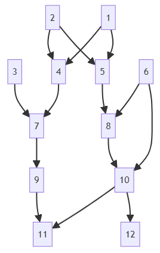

```{r, include = FALSE}
knitr::opts_chunk$set(
  collapse = TRUE,
  comment = "#>"
)
```

```{r setup}
library(FnR)
```

Let's use the following example pedigree.



```{r}
(ped <- data.frame(
  ID = 1:12,
  SIRE = c(0, 0, 0, 2, 2, 0, 4, 6, 0, 6, 10, 10),
  DAM = c(0, 0, 0, 1, 1, 0, 3, 5, 7, 8, 9, 0)
))
```

Let's assume that previously, 9 of 12 animals were in the pedigree, and inbreeding (`f`) and `d` coefficients (diagonal elements of the diagonal matrix **D** in $\mathbf A = \mathbf{TDT}'$) were calculated and saved.

```{r}
oldped <- ped[1:9, ]
(oldrun <- resume_inbreed(oldped, export_d = TRUE))
```

Calculating inbreeding coefficients as if `f` and `d` coefficients from the previous analysis are not available:

```{r}
resume_inbreed(ped)
```

Calculating inbreeding coefficients as if `f` coefficients from the previous analysis are available, but not `d` coefficients:

```{r}
resume_inbreed(ped, f = oldrun$f)
```

Calculating inbreeding coefficients as if `f` and `d` coefficients from the previous analysis are available:

```{r}
resume_inbreed(ped, f = oldrun$f, d = oldrun$d)
```

Let's calculate the numerator relationship coefficients between two groups of animals, one's members not among dams, and the members of the other not among sires.

```{r}
calcR(ped, set1 = c(12, 6), set2 = c(11, 8), type = "notdam-notsire")
```

What is the inbreeding coefficient of a future progeny of 11 and 12?
It is half of the relationship coefficient between the two individuals (0.320312/2).

Since `"notdam-notsire"` is the default type, `type = "notdam-notsire"` might be omitted.
Where relationship coefficients between dams and between sires are needed, `type = "dam-dam"` and `type = "sire-sire"` are used, respectively.

Let's calculate the numerator relationship coefficients between dam 7 and dams 8 and 9.

```{r}
calcR(ped, set1 = 7, set2 = 8:9, type = "dam-dam")
```

The relationship coefficients between sires 2 & 6 and sires 4 & 10 are calculated as:

```{r}
calcR(ped, set1 = c(2, 6), set2 = c(4, 10), type = "sire-sire")
```

If inbreeding coefficients of the population or previous inbreeding estimates with a smaller pedigree are available, those can be used via the argument `f` to speed up the procedure.
Similarly, if **d** coefficients are available, those can be used alongside the inbreeding coefficients via the argument `d`.

```{r}
f <- rep(0, 12)
f[10] <- 0.25
f[11] <- 0.015625
d <- c(1, 1, 1, 0.5, 0.5, 1, 0.5, 0.5, 0.75, 0.5, 0.4375, 0.6875)
calcR(ped, set1 = c(2, 6), set2 = c(4, 10), type = "sire-sire", f = f, d = d)
```

For very large pedigree and small `set1` and `set2`, one may consider extracting a sub-pedigree by tracing the pedigree upward from `set1` and `set2` (*i.e.*, `ggroups::pedup(ped, c(set1, set2))`).
